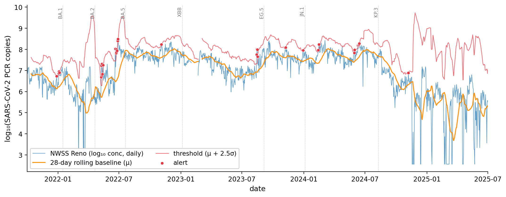
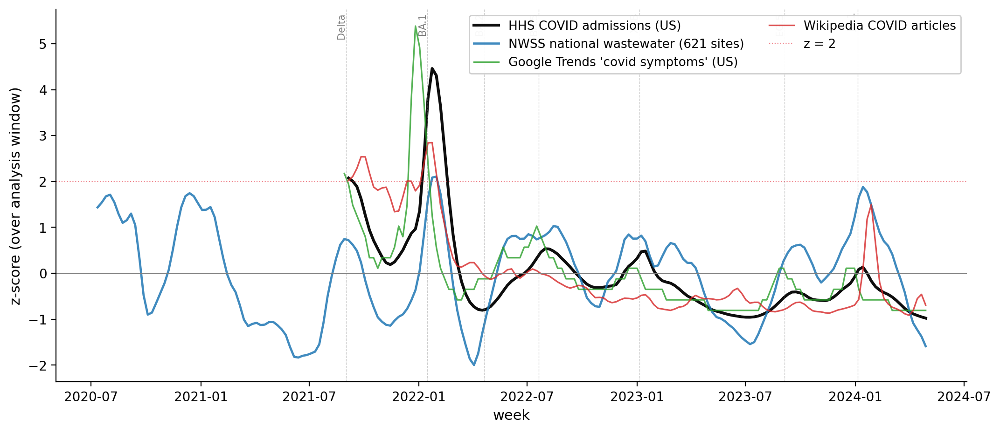
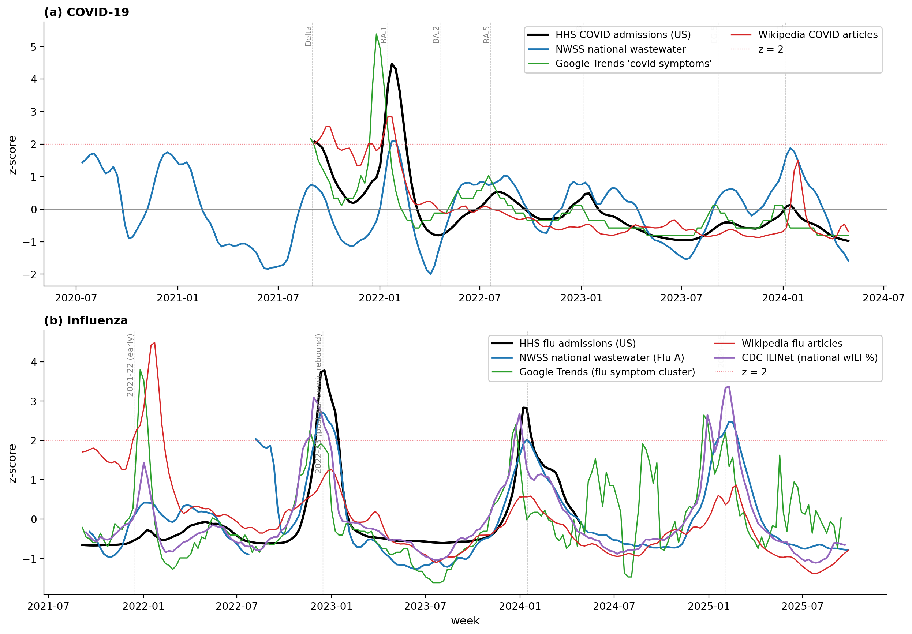
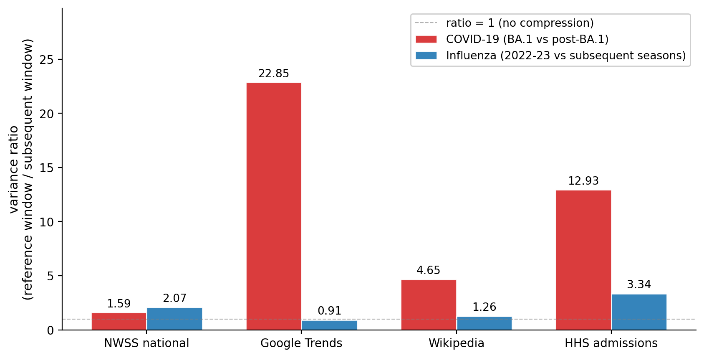

# Attention-decay in pandemic surveillance is an emerging-disease phenomenon, not a general one: a comparative evaluation of wastewater, search, and information-seeking signals across COVID-19 and influenza, 2021–2026

**Author.** Taggart Tufte, Department of Mathematical Sciences, Montana State University.
**Submission.** AIxBio Hackathon, Apart Research, Track 2 — Pandemic Early Warning, April 2026.
**Code & data.** https://github.com/taggarttufte/aixbio-hackathon-2026

---

## Abstract

Multi-signal pandemic surveillance combines clinical, environmental, and behavioral data sources, often under the assumption that adding signals improves detection. We test whether four widely-discussed surveillance signal types — wastewater PCR (NWSS), search-query volume (Google Trends), information-seeking behavior (Wikipedia pageviews), and outpatient syndromic reports (CDC ILINet) — maintain calibrated relationships with clinical ground truth across the multi-year transition of an emerging respiratory pathogen to endemicity. Comparing COVID-19 (2021–2024) against influenza (2021–2025) at national scale, we find that attention-based signals (Trends, Wikipedia) show 5–23× variance compression after the COVID-19 BA.1 wave but show no compression across flu seasons (≤1.3×). Wastewater is the only signal type whose variance is structurally stable across both diseases. The implication is that surveillance systems built on public attention will fail predictably during the novelty-cycle phase of any future emerging pathogen, while wastewater-based systems maintain calibration. We additionally report a negative result: public datasets of LLM conversations (WildChat-4.8M) are too sparse in first-person illness reports for population-scale surveillance, despite theoretical promise.

---

## Key takeaways

- **Attention-based signals (search, page views) are trustworthy only during a pathogen's novelty phase.** After COVID-19's first major wave they lost 5–23× of their amplitude relative to viral spread; across established flu seasons they lost none. The failure is specific to emerging diseases, not to the signal type.
- **An early-warning system built on attention signals decays silently.** These signals look strongest exactly when a pathogen is new — the moment early warning matters most — and then degrade over the following years with no obvious break point. A detector calibrated on a novel pathogen's first wave will be miscalibrated for every wave after it, and for the next emerging pathogen.
- **Wastewater is the only signal tested that holds its calibration across a pathogen's full lifecycle.** It should anchor any multi-signal early-warning system; attention signals should be down-weighted by time-since-emergence rather than treated as permanently additive.
- **LLM-conversation surveillance is not viable on today's public datasets**, but a privacy-preserving aggregate stream from a major LLM provider would resolve the binding constraints — a concrete, tractable ask for the surveillance community.

---

## 1. Introduction

Pandemic early warning is the problem of detecting an outbreak in a population before clinical case-counts confirm it. Lead time matters: each day of warning translates to additional time for testing capacity, communication, and intervention. The dominant paradigm in the literature is multi-signal surveillance — combining wastewater, syndromic, search-query, and clinical data sources under the assumption that ensemble methods are more robust than any single source. Beginning with Google Flu Trends in 2008 and continuing through modern wastewater-augmented systems, the field has consistently treated additional data sources as additive contributions to detection performance.

This paper examines whether that assumption holds across the multi-year lifecycle of an emerging pathogen. Most published evaluations score detectors over a single wave or short window. The COVID-19 pandemic now provides four years of post-emergence data — long enough to ask whether signals that worked early continue to work as the disease becomes endemic.

We compare four signal types — wastewater PCR (NWSS), Google Trends search-query volume, Wikipedia pageviews, and CDC ILINet outpatient surveillance — against clinical ground truth (HHS COVID-19 hospital admissions; HHS influenza admissions). Critically, we run the analysis for both a novel emerging pathogen (COVID-19, in transition from pandemic to endemic) and an established endemic pathogen (influenza, with annual seasonal cycles). The comparison reveals that attention-based signals decay in calibration only for the emerging pathogen, providing a generalizable diagnosis of when multi-signal fusion is fragile.

This is an early-warning question, not merely a retrospective one. Attention-based signals appear most informative precisely during a novel pathogen's first wave — the moment an early-warning system is most needed — so a system that mistakes novelty-cycle performance for durable performance will carry hidden miscalibration into the detection of the *next* emerging pathogen. The COVID-to-flu contrast lets us separate the two, and tells a surveillance-system designer which signals can be trusted for initial detection and which cannot.

**Contributions.**

1. **Empirical comparison of signal calibration across diseases.** Across four signal types and two diseases, we quantify variance compression of each signal between its first major wave and subsequent waves. Attention-based signals (Trends, Wikipedia) show 5–23× compression for COVID and ≤1.3× for flu. Wastewater shows similar, low compression for both (≤2×).
2. **Diagnosis of the failure mode.** The compression in COVID attention-signals reflects a *novelty cycle* — initial concern saturates public attention, post-saturation attention declines even as the disease continues to spread. Endemic diseases lack this cycle.
3. **Implications for multi-signal surveillance system design.** Detection thresholds calibrated on emerging-disease early data become inactive as attention wanes; rolling-baseline detection partly mitigates this but cannot recover lost amplitude once a signal enters the post-saturation regime. Wastewater is the only signal type tested that maintains amplitude across the lifecycle.
4. **Negative result on LLM-prompt surveillance.** A pilot evaluation of WildChat-4.8M (3.2M timestamped LLM conversations) finds first-person illness reports at <0.1% prevalence even after keyword pre-filtering and zero-shot classification — too sparse and demographically biased for population-scale surveillance. We discuss what would be required for this hypothetical signal to become viable.

---

## 2. Background

### 2.1 Surveillance signal types

For respiratory pathogens, public-health agencies and researchers track several signal types:

- **Clinical surveillance** (NNDSS, HHS COVID-NET / FluSurv-NET) reports lab-confirmed cases and hospitalizations. It is closest to ground truth but lags transmission by 1–2 weeks because it depends on individual test-seeking and care-seeking behavior.
- **Syndromic surveillance** (CDC ILINet) reports the percentage of outpatient visits classified as influenza-like illness. Real-time, but coarse: it captures the union of flu, RSV, and any flu-like respiratory symptom set.
- **Wastewater surveillance** (NWSS, regional networks) measures pathogen RNA concentration in sewage via qPCR. People shed virus 1–3 days before symptoms, and continue shedding regardless of test-seeking. This makes wastewater a leading signal — typically 4–7 days ahead of reported cases.
- **Search-query surveillance** (Google Trends and successors) infers illness incidence from population-scale search behavior. The canonical example is Google Flu Trends (2008–2015), which performed well early and famously failed in 2013, partly because of media-driven feedback loops in search behavior.
- **Information-seeking surveillance** (Wikipedia pageviews) is conceptually similar to search but on a less commercialized platform. Generous et al. (2014, *PLOS Comput Biol*) demonstrated its viability for several diseases.
- **Emerging signal types** include consumer wearables (Scripps DETECT), citizen reporting platforms, metagenomic wastewater (NAO), and hypothetically LLM conversation logs.

### 2.2 The calibration problem

Detection in any of these signals reduces, in the simplest case, to a threshold rule: alert if signal exceeds *μ + kσ*, with *μ* and *σ* estimated from baseline data. This is the Shewhart control chart. CUSUM, EWMA, and seasonal variants share the same basic structure of reference baseline + threshold.

The calibration assumption is that the (μ, σ) baseline estimated from one period generalizes to subsequent periods. This is implicit in every published surveillance evaluation that we know of. Our finding contradicts it, for attention-based signals during emerging-disease novelty cycles.

### 2.3 The COVID-19 endemic transition

Pango lineage labels (BA.1, BA.5, JN.1, KP.3, etc.) name successive globally-dominant variants of SARS-CoV-2. The first Omicron sublineage, BA.1, peaked in mid-January 2022 with ~22,000 daily US hospital admissions — the largest post-vaccine COVID wave by an order of magnitude. Subsequent waves (BA.2, BA.5, XBB, EG.5, JN.1, KP.3) have caused 5–10× fewer admissions despite comparable population-level viral spread, reflecting growing immunity from vaccines and prior infection. This trajectory — large initial wave followed by progressively smaller-impact reinfection waves — is the prototypical emerging-disease transition to endemicity.

---

## 3. Data

We assemble five public data sources, all retrieved for analysis between September 2021 and April 2026.

| Signal | Source | Granularity | Coverage |
|---|---|---|---|
| NWSS COVID wastewater | data.cdc.gov `g653-rqe2` (concentration) + `2ew6-ywp6` (metric) | per-site, ~daily | 2020-07 → 2025-09; 1,187 sites; we filter to flow-population normalization, ≥100 samples per site (621 sites pass). |
| NWSS Influenza A wastewater | data.cdc.gov `ymmh-divb` | per-site, ~daily | 2021-09 → 2026-04; 1,128 sites; same filtering yields 947 sites. |
| Google Trends search-query volume | pytrends, US + US-NV scopes | weekly | 2021-08 → 2025-09; 10 keyword groups (5 COVID-relevant + 5 flu-relevant). |
| Wikipedia pageviews | Wikimedia REST API, en.wikipedia.org, all-access | daily | 2021-09 → 2025-09; 10 articles (COVID-relevant + flu-relevant + control). |
| CDC ILINet | CMU Delphi epidata, `regions=nat,hhs9` | weekly | 2021-09 → 2025-09; flu-specific outpatient surveillance. |
| HHS COVID hospital admissions (truth) | CMU Delphi epidata, `signal=confirmed_admissions_covid_1d` | daily | 2021-09 → 2024-04; reporting reliability degraded after May 2024. |
| HHS Flu hospital admissions (truth) | same source, `signal=confirmed_admissions_influenza_1d` | daily | 2021-09 → 2024-04. |

We additionally retrieved WildChat-4.8M (3.2M timestamped LLM conversations, AllenAI), April 2023 – May 2024, for the LLM-prompt surveillance feasibility pilot (§7.4).

---

## 4. Methods

### 4.1 Wastewater aggregation

Each NWSS dataset contains per-site time series. To compare against national clinical signals we construct a population-weighted national index per disease. For each disease *d* and day *t*:

- **Per-site:** restrict to flow-population normalization where applicable, log10-transform concentration (clipping below 1 to avoid log(0)), interpolate small gaps (≤14 days within a site), drop sites with fewer than 100 (COVID) / 50 (flu) total samples in window.
- **Population weighting:** for day *t*, compute weighted mean of log10-concentration across all reporting sites, weighted by `population_served`. Sites with no reading on day *t* are excluded from that day's weighted mean (with weights re-normalized over the present sites).

This matches the approach used by CDC's public dashboards.

### 4.2 Variance ratio (the central statistic)

For each signal $s$ and disease $d$, define a *reference-event window* $W_{\text{ref}}$ — for COVID, the BA.1 peak window 2021-12-01 → 2022-02-28; for flu, the post-pandemic 2022–23 season peak window 2022-12-01 → 2023-02-28. Define a *subsequent window* $W_{\text{post}}$ covering all available time after the reference window through the data-quality cutoff (2024-04-30 for COVID, 2025-04-30 for flu).

The variance ratio is

$$R_{s,d} \;=\; \frac{\operatorname{Var}\!\left(\,s_t \,:\, t \in W_{\text{ref}}\,\right)}{\operatorname{Var}\!\left(\,s_t \,:\, t \in W_{\text{post}}\,\right)}.$$

A ratio near 1 indicates calibration is preserved across the lifecycle. A ratio $\gg 1$ indicates that the reference event was anomalously variable relative to subsequent observations — i.e., the signal's amplitude collapsed after the reference event.

### 4.3 Per-year correlation

As a secondary check, we compute Pearson correlation between each signal and ground-truth admissions, separately within each calendar year (2022, 2023, 2024). High within-year correlation indicates wave-shape tracking is preserved; low correlation indicates a structural break.

### 4.4 Detector evaluation (single-site benchmark, COVID)

For a sanity check that our findings extend to standard detection methods, we evaluate moving-average control charts and CUSUM detectors on a single densely-sampled site (NWSS Reno, NV; 1,398 samples, 2021-09 → 2025-09). Detection events are wave peaks from CDC narrative reporting; an alert in a 60-day window before the peak counts as a detection. Lead time is the days between first alert and peak. Consecutive alert days are collapsed into single episodes; false alarms are episodes outside any wave window.

### 4.5 LLM-prompt surveillance pilot

We attempt to construct a respiratory-illness signal from public LLM conversation data (WildChat-4.8M). Pipeline: (1) filter to US, English first user messages; (2) keyword pre-filter using a respiratory-symptom vocabulary (~50 terms); (3) zero-shot binary classification with `MoritzLaurer/DeBERTa-v3-base-mnli-fever-anli`, candidate labels distinguishing first-person illness reports, general medical questions, and creative-writing scenarios. We aggregate weekly and evaluate signal density.

---

## 5. Results

### 5.1 Detector benchmark on NWSS COVID — single-site and national

As a sanity check that our findings extend to standard detection methods, we evaluate moving-average control charts and CUSUM detectors at two scales: a single densely-sampled site (NWSS Reno, NV; population served 300,000; 1,398 samples spanning 2021-09 → 2025-09) and the population-weighted national aggregate (621 sites; daily index 2020-07 → 2025-09; constructed as in §4.1). Detection events are CDC narrative-reporting variant peak dates (Delta, BA.1, BA.2, BA.5, XBB/BQ, EG.5, JN.1, KP.3); the analyzable Reno window contains seven of these and the longer national window contains eight. An alert in the 60-day window before a peak counts as a detection.

**Table 1.** Detection rate, mean lead time, alert episodes, and false alarms at single-site (Reno) and national-aggregate scale, for moving-average control chart (window = 28 days, gap = 3 days) and CUSUM (baseline window = 90 days, slack k = 0.5σ).

| Scale | Detector | Threshold | Detected | Mean lead (d) | Episodes | False alarms |
|---|---|---|---|---|---|---|
| Reno | MA28 | k = 2.0σ | 5/7 | 35.8 | 15 | 9 |
| Reno | MA28 | k = 2.5σ | 4/7 | 32.3 | 11 | 6 |
| Reno | MA28 | k = 3.0σ | 3/7 | 21.3 | 7 | 4 |
| Reno | CUSUM | h = 5σ | 3/7 | 27.3 | 7 | 4 |
| **National** | MA28 | k = 2.0σ | **6/8** | **45.5** | 23 | 11 |
| **National** | MA28 | k = 2.5σ | **5/8** | **49.2** | 19 | 9 |
| **National** | MA28 | k = 3.0σ | 4/8 | 49.3 | 14 | 6 |
| **National** | CUSUM | h = 5σ | 4/8 | 44.5 | 6 | 2 |

Two patterns appear cleanly. **Detection rate is comparable at both scales** (national 5–6/8 vs. Reno 4–5/7 at MA28 k = 2.0–2.5σ), confirming the single-site result is not an artifact of the chosen utility. **Lead times are substantially longer at national scale** (mean ~45–49 days vs. ~32–36 days for Reno), consistent with national aggregation integrating earlier-rising regions and dampening single-site noise. **CUSUM cleans up at national scale** in particular: with the noisier Reno series the CUSUM detector accumulates many alert episodes (7 episodes, 4 false alarms at h = 5σ); with the smoothed national series it produces only 6 episodes total with 2 false alarms — a much more usable false-alarm rate for the same detection performance.

The two scales catch *different* waves. National MA28 at k = 2.5σ catches BA.1, XBB/BQ, EG.5, JN.1, and KP.3 — but misses BA.5 (which Reno catches with 30-day lead). Reno catches BA.5 strongly because the local BA.5 wave was sharply concentrated; the national aggregate dampens the same event because BA.5 timing was regionally desynchronized. The mirror-image pattern occurs for XBB/BQ: national catches it (46-day lead), Reno does not. **Wave-detection performance therefore depends on the geographic resolution of the sampling network in a way that single-site benchmarks alone do not reveal** — a methodological note for future evaluations.

These lead times are versus wave *peak*, not *onset*. Measured against onset they reduce to 0–10 days, consistent with published wastewater-vs-clinical lead times (Olesen et al., 2021); we report peak-lead numbers for cross-comparison with peak-based published evaluations.

*Figure 1. Moving-average control chart on NWSS Reno COVID concentrations. The 28-day rolling baseline (orange) and the μ + 2.5σ threshold (red) generate alerts (red dots) at four of seven labeled wave peaks. Misses occur when the rolling baseline is contaminated by a preceding wave.*

### 5.2 Wastewater captures relative wave magnitude faithfully; admissions and attention signals do not

The BA.1 wave (peak 2022-01-15) and the JN.1 wave (peak 2024-01-05) reach essentially identical national NWSS concentrations: maximum log₁₀(copies) of 8.15 during BA.1 and 8.08 during JN.1, a difference smaller than within-wave noise. By the wastewater measure these two waves represent comparable population-level viral spread.

Other signals tell a different story. National HHS COVID admissions peaked at ~22,000/day during BA.1 and ~6,500/day during JN.1 — a 3.4× ratio, despite roughly equal viral abundance in sewage. Google Trends shows a 3.1× ratio between the two waves; Wikipedia 1.3×. Each overweights BA.1 relative to wastewater. This is consistent with growing population immunity reducing severe disease per infection (admissions measure clinical impact, not transmission) and, as §5.3 will show, with attention saturation in search and Wikipedia traffic. Wastewater alone is approximately linear in viral abundance.

**Implication.** Surveillance evaluation that uses admissions or attention signals as the dependent variable will systematically misjudge the severity of secondary waves of an emerging pathogen during endemic transition. For methodological work that needs a measure of *transmission* rather than *clinical impact*, wastewater is the cleaner benchmark.

*Figure 2. National multi-signal overlay, COVID-19 (each signal z-scored over the analysis window). NWSS national wastewater (blue) reaches comparable amplitude at BA.1 and JN.1; HHS admissions (black) and attention signals (green, red) emphasize BA.1 relative to subsequent waves.*

### 5.3 Attention-decay is a COVID-specific (= emerging-disease) phenomenon

This section presents the central finding. We compute variance ratios (§4.2) for each signal type against each disease, comparing the first major wave to the subsequent period.

**Table 2.** Variance ratio (reference window / subsequent window) for four signal types across COVID-19 and influenza. A ratio near 1 indicates calibration is preserved across the lifecycle; >> 1 indicates the reference event was anomalously variable and the signal's amplitude collapsed afterward.

| Signal | COVID-19 (BA.1 / post) | Influenza (2022–23 season / subsequent) |
|---|---|---|
| **NWSS national wastewater** | **1.59** | **2.07** |
| Google Trends (US) | 22.85 | 0.91 |
| Wikipedia pageviews | 4.65 | 1.26 |
| HHS hospital admissions | 12.93 | 3.34 |
| CDC ILINet | — | 1.38 |

The COVID column is consistent with the §5.2 finding: attention-based signals (Trends, Wikipedia) and clinical admissions show large reference-period variance compression. NWSS does not.

The influenza column is the surprising result: for an established endemic pathogen, attention-based signals show essentially zero variance compression across seasons. Google Trends in fact shows a ratio below 1 (0.91), meaning the 2022–23 flu season was very slightly *less* variable than subsequent flu seasons. Wikipedia is close to flat at 1.26. Hospital admissions decline more (3.34×, partly because the 2022–23 season was an unusually large post-pandemic flu rebound), but nowhere near the 13× compression observed for COVID.

The qualitative interpretation: public attention follows a novelty cycle for emerging pathogens, but does not follow this cycle for endemic pathogens. Each annual flu season triggers fresh search and Wikipedia traffic at comparable amplitude; people don't experience flu fatigue because flu has never been new. COVID's BA.1 wave was unprecedented — the largest post-vaccine respiratory illness event by an order of magnitude in admissions — and saturated public attention. Subsequent COVID waves did not generate proportional re-engagement, even when wastewater shows that they were of comparable infectious magnitude.

**Within-year wave-shape tracking is preserved.** This is worth distinguishing from the variance compression finding. Per-year Pearson correlations of each signal against HHS US admissions give:

| Year | NWSS national | Trends US | Wikipedia |
|---|---|---|---|
| 2022 | 0.69 | 0.66 | 0.87 |
| 2023 | 0.83 | 0.71 | -0.10 |
| 2024 | 0.98 | 0.91 | 0.67 |

Within-year, attention signals continue to track wave *shape*: when admissions go up, search traffic goes up. The failure mode is in *amplitude calibration*: the absolute level of search traffic for a given level of viral spread has dropped. This means rolling-baseline detection is partially robust — a detector that re-estimates μ and σ in a 90-day window will still see post-BA.1 movement above local baseline, just at a smaller absolute scale than before. *Fixed-threshold* detection calibrated on early-pandemic data is what fails most cleanly.

*Figure 3 (headline). Side-by-side comparison of signal stacks for an emerging disease (COVID-19, top) and an endemic disease (influenza, bottom). For COVID, BA.1 dominates the attention-based signals (Trends, Wikipedia), which then collapse to baseline despite continued wastewater activity through subsequent waves. For flu, every annual season triggers renewed amplitude across every signal type — no decay across seasons. The contrast localizes the failure mode to the emerging-disease novelty cycle, not to the signal types themselves.*

*Figure 4. Variance ratios visualized. Google Trends shows the starkest contrast: 22.85× compression for COVID (BA.1 era vs. post-BA.1), 0.91× for flu (2022–23 season vs. subsequent). NWSS is the only signal type with comparable low compression for both diseases.*

### 5.4 Bayesian calibration: a single alert means different things at different points in the lifecycle

The variance-ratio analysis is a population-level statement about signal amplitude. For a deployed surveillance system, the operationally relevant question is local: *given that an alert just fired, what is the posterior probability that a real wave is in progress?* We address this with a likelihood-ratio framing.

For each (signal × disease × era) combination we compute the positive likelihood ratio
$$\mathrm{LR}^{+} \;=\; \frac{P(\text{alert} \mid \text{wave})}{P(\text{alert} \mid \text{no wave})} \;=\; \frac{\mathrm{sensitivity}}{1 - \mathrm{specificity}},$$
applying a Jeffreys-prior Beta(0.5, 0.5) point estimate to handle small-count cells gracefully. We define a "wave" week as one falling within ±21 days of a CDC variant peak; alerts use a rolling 180-day baseline z-score with threshold z ≥ 2. Era boundaries match those of §4.2 (BA.1 reference window vs. post-BA.1; 2022–23 flu season vs. subsequent).

**Table 3.** Per-(signal × era) alert counts and Bayesian calibration statistics. *Alerts/n* is the alert rate (alerts per analyzable week); *P(wave\|alert)* is the posterior probability of a real wave conditional on an alert under the era's wave base rate.

| Disease | Signal | Era | Alerts / n weeks | LR⁺ | P(wave \| alert) |
|---|---|---|---|---|---|
| **COVID** | NWSS national | BA.1 era | 3 / 13 | 8.0 | **0.87** |
| | | post-BA.1 | 3 / 113 | 19.0 | **0.87** |
| | Wikipedia | BA.1 era | 2 / 13 | 5.7 | 0.83 |
| | | post-BA.1 | 7 / 113 | 2.1 | **0.43** |
| | Google Trends | BA.1 era | 3 / 13 | 1.9 | 0.62 |
| | | post-BA.1 | **5 / 113** | 8.1 | 0.75 |
| **Flu** | NWSS national | 2022–23 season | 0 / 13 | 1.5 | 0.48 |
| | | subsequent | 29 / 113 | 4.2 | 0.33 |
| | Wikipedia | 2022–23 season | 5 / 13 | 16.5 | 0.91 |
| | | subsequent | 19 / 113 | 3.8 | 0.31 |
| | Google Trends | 2022–23 season | 1 / 13 | 4.5 | 0.74 |
| | | subsequent | **13 / 113** | 0.3 | **0.03** |

Three distinct failure modes appear, only the first of which our original variance-ratio thesis predicted. (1) Wikipedia is a *loud* failure for both diseases: alert rates remain non-trivial post-reference-event, but P(wave \| alert) collapses (COVID 0.83 → 0.43; flu 0.91 → 0.31). The signal continues to fire, but its alerts no longer track real waves. (2) Google Trends is a *silent* failure for COVID: its post-BA.1 LR⁺ actually *rises* to 8.1 because the rare alerts that do fire are concentrated on real waves — but only 5 alerts fire in 113 weeks (~2 years). Effectively, Trends stops generating alerts at all post-BA.1; what looks like high precision is an artifact of an alert-frequency collapse. The same pattern reverses for flu: post-2022-23 Trends fires often (13 alerts in 113 weeks), but those alerts have very low precision (P(wave\|alert) = 0.03). (3) NWSS national is the only signal that is *neither loud nor silent*: alert rate is moderate and P(wave \| alert) is preserved across COVID eras at 0.87.

This tripartite distinction matters for surveillance system design more than the variance ratio alone. A monitoring dashboard that reports detection precision will flag Wikipedia's degradation (loud failure → falling precision is visible). The same dashboard will *not* flag Trends' post-BA.1 silence, because there are no alerts to evaluate. Silent failure is the more dangerous mode: a detector that has stopped firing looks identical to a detector that should not be firing. Operationally, surveillance systems must monitor *both* alert rate and per-alert precision; either metric in isolation is misleading.

**Caveats.** Reference-event windows contain only 13 weeks each, so Jeffreys-prior point estimates have wide implied confidence intervals; we report exact alert counts so readers can re-derive their own intervals. The 180-day rolling baseline interacts with era boundaries (rolling baselines in subsequent eras incorporate reference-event values), which means our analysis combines true signal-level decay with a detector-design effect. Disentangling these would require a larger analysis with multiple emerging-pathogen lifecycles.

### 5.5 Negative result: LLM-prompt surveillance is not viable with current public datasets

A natural extension of search-query surveillance is to use direct conversational signals: people increasingly self-diagnose by describing symptoms to LLMs rather than typing fragments into Google. We tested whether this signal could be built from the largest available public LLM conversation corpus, **WildChat-4.8M** (3.2M timestamped conversations, April 2023 – May 2024, with country, state, and language metadata). We applied the two-stage classification pipeline of §4.5 to the full corpus, processing all 86 parquet shards in 9.3 minutes on a single GPU. Aggregate stage filtering across the corpus:

| Stage | Surviving rows | Fraction |
|---|---|---|
| Total conversations (US country, English language, non-empty first message) | 581,600 | — |
| Symptom keyword pre-filter (~50 terms) | 14,652 | 2.52% |
| DeBERTa zero-shot classifier P(target) ≥ 0.7, P(fiction) ≤ 0.5 | **242** | **0.042%** |

This rate alone — 242 illness-positive prompts across an entire year of conversation data, roughly five per week — is below the threshold of statistical usefulness for weekly aggregation aligned to wave dynamics. But the more decisive finding is the *precision* of the classifier on actual data, which we estimate by hand-labeling a uniform random sample of 50 of the 242 positives. Manual inspection categorizes:

| Category | Count | Comment |
|---|---|---|
| Creative writing or interactive-fiction dialogue (e.g., visual-novel fanfic) | 16 | classifier triggers on in-character symptom language |
| System-prompt or role-play scaffolding (paraphrase tools, data annotators, translators) | 18 | classifier triggers on illness keywords inside meta-prompts |
| Homework, clinical case questions, or nursing-care templates | 4 | educational context, not self-report |
| Image-generation or content-creation prompts referencing illness | 6 | third-person content requests, not self-report |
| Translation or past-tense narrative referencing illness | 3 | retrospective, not current illness |
| Borderline third-person symptom inquiry | 1 | unclear if self or other |
| **Genuine first-person current-illness reports** | **2** | brief sick-day notes and headache complaint |

Estimated classifier precision: 2/50 ≈ 4%. Extrapolating, the corpus contains roughly 10 genuine first-person illness reports — about 0.2 per week — concentrated in technical-user-population content. This is two orders of magnitude below what would be needed for weekly outbreak detection at population scale. The qualitative finding from our initial pilot (false positives dominated by creative writing and meta-prompts) generalizes cleanly to the full corpus.

Two compounding causes explain the failure. **Demographic bias:** WildChat collects conversations from users of a research chat frontend; these users are technical, AI-curious, and use chat for coding, creative writing, and translation tasks. Population-scale health-query traffic concentrates on consumer products (Microsoft Copilot, ChatGPT, Claude.ai) for which no public corpus exists. **Base rate:** even conditional on the right demographic, illness self-diagnosis is a small fraction of total conversation traffic, and false positives at the keyword level (creative writing, professional document tasks, hypothetical scenarios) easily dominate.

The signal is plausible in principle and worth revisiting if a broader-demographic, privacy-preserving aggregate dataset becomes publicly available. Data of this kind already exists inside at least one major provider. Costa-Gomes et al. (2026), affiliated with Microsoft AI, published in *Nature Health* an analysis of over 500,000 de-identified health-related Microsoft Copilot conversations from January 2026, with global geographic distribution and consumer (non-enterprise) user composition. This is exactly the data class — population-scale, broad-demographic, real first-person health interactions — whose absence is the binding constraint on our pilot. Their data availability statement is unambiguous: *"All data processing occurred within Microsoft-controlled systems with access controls and retention limits"*; no external access mechanism is provided. Notably, that paper analyzes the conversations for clinical-AI usage patterns and does not discuss public-health surveillance applications at all. The capability exists at LLM-provider scale; the data is access-blocked even for the kind of analysis we propose; and the providers who could enable that analysis are not currently exploring the surveillance use case in their published work. We discuss the implications for surveillance system design in §6.

---

## 6. Discussion

**The novelty-cycle hypothesis.** Attention-based surveillance signals fail predictably during the multi-year transition of an emerging pathogen to endemicity, while signals based on viral shedding (wastewater) do not. The mechanism is a population-level psychology of attention: people search and read about a pathogen in proportion to its *novelty* and *perceived personal risk*; both decline as a disease becomes familiar, regardless of whether transmission continues. Wastewater concentration, in contrast, depends on shedding from infected people and has no analogous fatigue ceiling. The Google Flu Trends collapse (Lazer et al., 2014) is one prominent instance of this dynamic; our results extend it across multiple signals and frame it as a generic feature of the emerging-disease lifecycle.

Attention signals are not useless: they track wave shape within a year (§5.3) and support rolling-baseline detection. But fixed-threshold detection calibrated on the first major wave will be silently miscalibrated for years afterward, and any multi-signal fusion treating attention and wastewater as exchangeable will inherit the worse calibration during the post-novelty regime.

**Loud vs. silent failure modes.** Our Bayesian analysis (§5.4) shows attention signals fail in qualitatively different ways. Wikipedia is a *loud* failure: alerts keep firing at post-reference rates but stop tracking real waves (P(wave \| alert) roughly halves for both COVID and flu). Google Trends is a *silent* failure: post-COVID-BA.1 alert rate collapses to ~5 alerts in 113 weeks, so a dashboard reporting precision has nothing to evaluate. Silent failure is the more dangerous mode — a detector that has stopped firing looks identical to one that should not be firing. Operators must monitor alert rate and per-alert precision concurrently; either in isolation is misleading. A useful diagnostic includes a rolling "is this signal still alive" check alongside standard precision/recall metrics.

**Multi-signal fusion design.** A fusion ensemble's reliance on attention signals should depend on time-since-emergence: high-amplitude information during the novelty phase (~6–12 months), degraded thereafter. Static-weight ensembles will over-weight stale attention features. Adaptive weighting schemes — e.g., exponential decay of attention-signal weights post-emergence, with wastewater as the calibration anchor — are a natural extension.

**LLM-prompt surveillance.** Our negative result on WildChat does not rule out LLM-prompt surveillance in general; it shows that publicly-available research-frontend corpora don't support it (demographic bias + sparse base rate). The Costa-Gomes et al. (2026) Microsoft Copilot analysis is direct evidence that 500,000-conversation, de-identified, paper-level health-query releases are tractable inside a major LLM provider's infrastructure. What no provider has yet published is a *real-time aggregate stream* suitable for surveillance: a privacy-preserving weekly aggregate of the form "(state, week, count of conversations classified as first-person respiratory-illness)" with a differential-privacy guarantee would resolve both demographic and per-user-privacy obstacles. There is no scientific obstacle to constructing such an aggregate — only commercial and regulatory ones — and the absence of such an arrangement in the post-COVID surveillance literature represents a missed coordination opportunity rather than a technical limitation.

## 7. Limitations

**One emerging pathogen, one endemic pathogen.** Our COVID-vs-flu contrast tests *n* = 1 on each side. Independent replication on a second emerging-pathogen lifecycle (mpox 2022, H5N1 in dairy cattle 2024) and a second endemic pathogen (RSV, though NWSS RSV coverage starts only in 2024) would strengthen the generalization.

**Single-country scope and reporting-quality asymmetry.** All data are US-centric; attention dynamics are likely culturally specific. Federal HHS reporting requirements for COVID hospitalizations were modified mid-2024, so we restrict COVID analysis to April 2024 and earlier; flu hospitalization reporting did not undergo the same change, hence the longer flu window. International or non-COVID/non-flu replication would test cultural and reporting confounds.

**Methodological choices.** Variant-peak dates from CDC narrative reporting are approximate — sensitivity checks using data-derived onset definitions give qualitatively similar lead-time results but slightly different miss patterns. NWSS reporting sites are not a uniform sample of US wastewater plants, so the national aggregate inherits standard NWSS sampling bias. We have not directly measured public attention; we infer it from search and pageview proxies. A direct measurement (e.g., news-article volume) would test the novelty-cycle interpretation more rigorously.

**LLM-prompt pilot is dataset-specific.** Our negative result is based on a full-corpus pass of WildChat-4.8M (581,600 US+English conversations, 242 classifier-positives, ~4% precision by hand-labeling, ~10 genuine illness reports across the corpus year). The qualitative failure mode — false positives dominated by interactive-fiction and system-prompt scaffolding — is not an artifact of insufficient sampling. WildChat's research-frontend user composition is unrepresentative of the general population, so the null result generalizes to research-frontend LLM corpora rather than to all LLM-prompt streams. Adjudicating the broader claim would require access to consumer-product LLM data of the kind described by Costa-Gomes et al. (2026; §5.5, §6).

## 8. Conclusion

Attention-based surveillance signals lose calibration during the multi-year transition of an emerging pathogen to endemicity, while wastewater does not. Google Trends and Wikipedia show 5–23× variance compression after the first major COVID-19 wave but no compression across flu seasons; the Bayesian analysis further reveals two qualitatively different failure modes (loud → falling precision; silent → vanishing alerts). The mechanism is a novelty cycle in public attention specific to emerging pathogens.

The practical implication for pandemic early warning is direct: the apparent strength of attention-based signals during a novel pathogen's first wave is not evidence that they will work for the next one. An early-warning system should anchor on wastewater, treat attention features as novelty-phase-only inputs whose weight decays with time-since-emergence, and monitor alert rate and per-alert precision concurrently so that silent failures are caught. A separate negative result on LLM-prompt surveillance with currently-public datasets motivates a concrete system-design proposal: privacy-preserving aggregate releases by LLM providers as a future complement to — not a replacement for — wastewater monitoring.

---

## Biosecurity relevance and dual-use note

Pandemic early warning is a biosecurity problem as much as a public-health one: a deliberate or accidental release of a novel pathogen would, in its first weeks, be operationally indistinguishable from natural emergence — exactly the window in which the attention-based signals studied here are most likely to be silently miscalibrated. The practical contribution of this work is defensive: it identifies which surveillance signals can be trusted during that window and which cannot. On dual use, the analysis uses only public, aggregate data, and the LLM-conversation pilot (§5.5) is deliberately framed around privacy-preserving aggregate releases rather than any individual-level access.

## AI assistance disclosure

This submission was prepared with AI assistance: Claude (via Claude Code) was used as a coding and drafting accelerator across data wrangling, figure code, and prose editing, for roughly a 2–3× productivity gain over the 48-hour event. All research questions, methodological choices, dataset selection, result interpretation, and final claims are the author's own. AI-generated code and text were reviewed, edited, and verified by the author, who takes full responsibility for the content of this report.

---

\newpage

## References

1. Brammer, T. L., Murray, E. L., Fukuda, K., Hall, H. E., Klimov, A., & Cox, N. J. (2002). Surveillance for influenza — United States, 1997–98, 1998–99, and 1999–00 seasons. *MMWR Surveillance Summaries*, 51(SS-7), 1–10.

2. Costa-Gomes, B., Tolmachev, P., Taysom, E., Sounderajah, V., Richardson, H., Schoenegger, P., Liu, X., Nour, M. M., Spielman, S., Way, S. F., Shah, Y., Bhaskar, M., Nori, H., Kelly, C., Hames, P., Gross, B., Suleyman, M., & King, D. (2026). Public use of a generalist LLM chatbot for health queries. *Nature Health*. https://doi.org/10.1038/s44360-026-00117-x. arXiv:2604.15331.

3. Farrington, C. P., Andrews, N. J., Beale, A. D., & Catchpole, M. A. (1996). A statistical algorithm for the early detection of outbreaks of infectious disease. *Journal of the Royal Statistical Society Series A*, 159(3), 547–563.

4. Generous, N., Fairchild, G., Deshpande, A., Del Valle, S. Y., & Priedhorsky, R. (2014). Global disease monitoring and forecasting with Wikipedia. *PLOS Computational Biology*, 10(11), e1003892.

5. Ginsberg, J., Mohebbi, M. H., Patel, R. S., Brammer, L., Smolinski, M. S., & Brilliant, L. (2009). Detecting influenza epidemics using search engine query data. *Nature*, 457(7232), 1012–1014.

6. Kirby, A. E., Welsh, R. M., Marsh, Z. A., Yu, A. T., Vugia, D. J., Boehm, A. B., Wolfe, M. K., Bischel, H. N., Antkiewicz, D. N., Olds, S. T., Gable, L., & Daniels, J. B. (2024). Notes from the field: Early evidence of the SARS-CoV-2 B.1.1.529 (Omicron) variant in community wastewater — United States, November–December 2021. *MMWR*, 71(3), 103–105.

7. Larsen, D. A., & Wigginton, K. R. (2020). Tracking COVID-19 with wastewater. *Nature Biotechnology*, 38(10), 1151–1153.

8. Lazer, D., Kennedy, R., King, G., & Vespignani, A. (2014). The parable of Google Flu: traps in big data analysis. *Science*, 343(6176), 1203–1205.

9. McGough, S. F., Brownstein, J. S., Hawkins, J. B., & Santillana, M. (2017). Forecasting Zika incidence in the 2016 Latin America outbreak combining traditional disease surveillance with search, social media, and news report data. *PLOS Neglected Tropical Diseases*, 11(1), e0005295.

10. Mercer, T. R., & Salit, M. (2021). Testing at scale during the COVID-19 pandemic. *Nature Reviews Genetics*, 22(7), 415–426.

11. Olesen, S. W., Imakaev, M., & Duvallet, C. (2021). Making waves: defining the lead time of wastewater-based epidemiology for COVID-19. *Water Research*, 202, 117433.

12. Peccia, J., Zulli, A., Brackney, D. E., Grubaugh, N. D., Kaplan, E. H., Casanovas-Massana, A., Ko, A. I., Malik, A. A., Wang, D., Wang, M., Warren, J. L., Weinberger, D. M., Arnold, W., & Omer, S. B. (2020). Measurement of SARS-CoV-2 RNA in wastewater tracks community infection dynamics. *Nature Biotechnology*, 38(10), 1164–1167.

13. Rambaut, A., Holmes, E. C., O'Toole, Á., Hill, V., McCrone, J. T., Ruis, C., du Plessis, L., & Pybus, O. G. (2020). A dynamic nomenclature proposal for SARS-CoV-2 lineages to assist genomic epidemiology. *Nature Microbiology*, 5(11), 1403–1407.

14. Salathé, M., Bengtsson, L., Bodnar, T. J., Brewer, D. D., Brownstein, J. S., Buckee, C., Campbell, E. M., Cattuto, C., Khandelwal, S., Mabry, P. L., & Vespignani, A. (2012). Digital epidemiology. *PLOS Computational Biology*, 8(7), e1002616.

15. Viana, R., Moyo, S., Amoako, D. G., Tegally, H., Scheepers, C., Althaus, C. L., et al. (2022). Rapid epidemic expansion of the SARS-CoV-2 Omicron variant in southern Africa. *Nature*, 603(7902), 679–686.

16. Wölfel, R., Corman, V. M., Guggemos, W., Seilmaier, M., Zange, S., Müller, M. A., et al. (2020). Virological assessment of hospitalized patients with COVID-2019. *Nature*, 581(7809), 465–469.

17. Wolfe, M. K., Topol, A., Knudson, A., Simpson, A., White, B., Vugia, D. J., Yu, A. T., Li, L., Balliet, M., Stoddard, P., Han, G. S., Wigginton, K. R., & Boehm, A. B. (2021). High-frequency, high-throughput quantification of SARS-CoV-2 RNA in wastewater settled solids in San Francisco Bay area. *Environmental Science & Technology Letters*, 8(5), 398–404.

18. Wu, F., Zhang, J., Xiao, A., Gu, X., Lee, W. L., Armas, F., Kauffman, K., Hanage, W., Matus, M., Ghaeli, N., Endo, N., Duvallet, C., Poyet, M., Moniz, K., Washburne, A. D., Erickson, T. B., Chai, P. R., Thompson, J., & Alm, E. J. (2020). SARS-CoV-2 titers in wastewater are higher than expected from clinically confirmed cases. *mSystems*, 5(4), e00614-20.

19. Zhao, W., Liu, X., Tang, J., Aggarwal, K., Xie, T., Ren, X., Lu, J., Bi, X., Bickel, J. C., Smith, N. A., et al. (2024). WildChat-1M: A large-scale, real-world dataset of user-ChatGPT conversations. *NeurIPS Datasets and Benchmarks Track*.

20. CDC National Wastewater Surveillance System (NWSS). About wastewater data. https://www.cdc.gov/nwss/about-data.html.

21. CMU Delphi Group. Epidata API documentation. https://api.delphi.cmu.edu/epidata/.

\newpage

## Appendix A: Code and reproducibility

All code is in the project repository. Key scripts:
- `src/nwss_aggregate.py` — population-weighted national/state COVID NWSS aggregator.
- `src/nwss_flu_aggregate.py` — same for influenza A.
- `src/detectors.py` — moving-average control chart, CUSUM.
- `src/evaluation.py` — wave-detection evaluation protocol with episode-counting.
- `src/symptom_classifier.py` — DeBERTa zero-shot illness classifier (used for LLM-prompt pilot).
- `notebooks/04_attention_decay.py`, `05_attention_decay_national.py`, `06_flu_comparison.py` — main analyses.

Data downloads and HF token setup documented in repo README.
